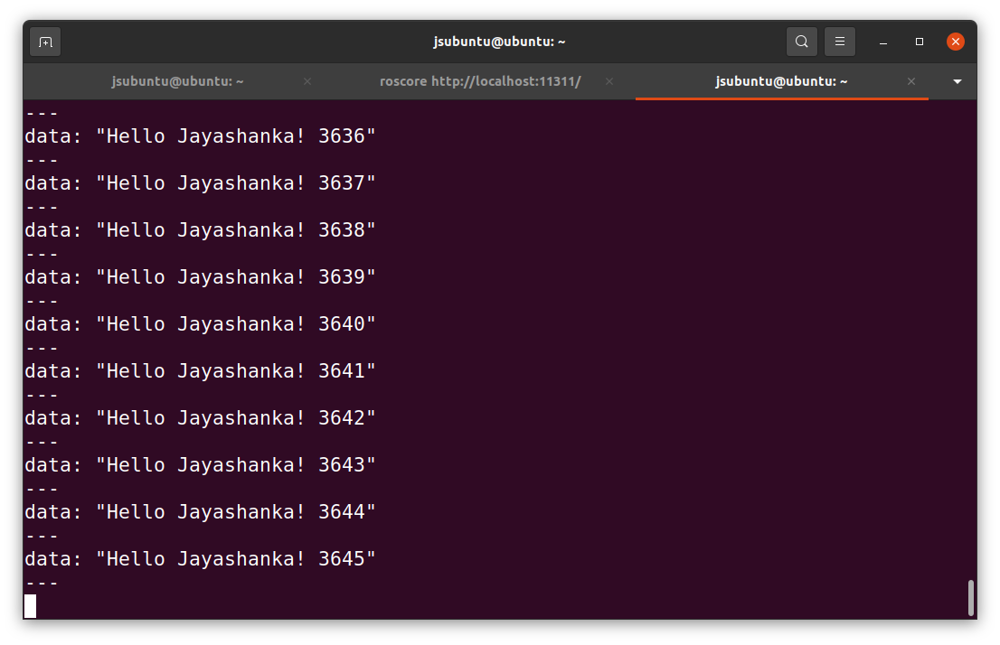

# <u>First Try</u>

This entire project run via VMWare that i installed Ubuntu 20.4 LTS, ROS and other neccassary fies.

1. First installed essential libraries to Ubuntu;

```sudo apt install ros-noetic-rosserial```

```sudo apt install ros-noetic-rosserial-arduino```

```sudo apt install ros-noetic-rosserial-python```

2. Then created a folder to save arduino sketches and codes. This part will happen in Host PC. _I creatd the folder as "**ArduinoSketches**"._

3. Install ROS Communication library via Arduino IDE. Library is "Rosserial Arduino".

4. Connect a PC to Arduino board and via Device manager i check the port (ex: COM6)

5. Then in VMWare i went to Vitual Machine setting and under "Hardware" added a Serial Port and selected the above port and clicked "OK". Need to keep on "Connect at power on".

6. Then via examples, I took Hello World example and uploaded the code to Arduino board. (This time need to disconnect the port from virtual machine).

7. Then Reconnect the port to virtual machine. I gave access to the port as below command;

```sudo chmod 666 /dev/ttyS1```

if this is not permitted, give permission by below code aand then again re-run the above code;

```sudo chown $USER:dialout /dev/ttyS1```

8. Then go to the Virtual Machine and open terminal. Run the ros mater;

```roscore```

9. Run below code to see the results.

```rosrun rosserial_python serial_node.py /dev/ttyS1```

will see results as below;

