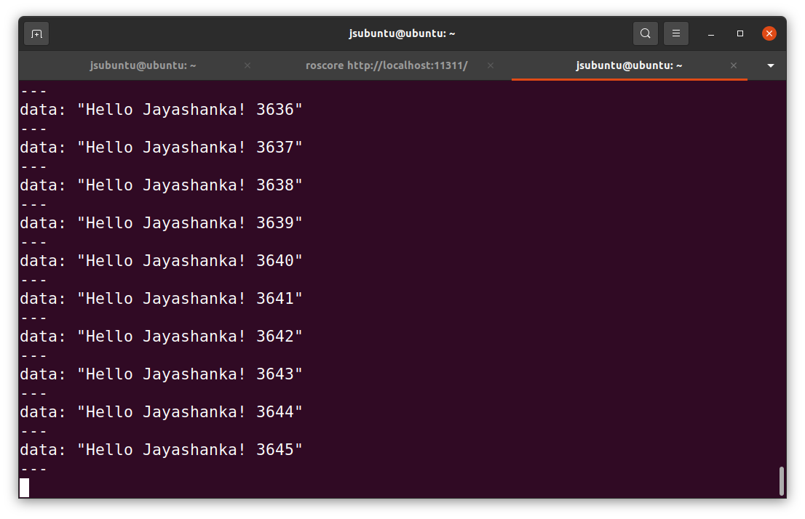

# <u>ROS Arduino LED Control</u>

In this project i am going to communicate between simple ROS program with Arduino Uno board and light a LED. Below is the inialization and configuration steps.

## Install Arduino
For install arduino need to run below code.

```sudo apt install arduino```

This will install Arduino and below code can use to check the version

```arduino --version```

If got any error regarding 'dialout', install below library.

```sudo apt install libcanberra-gtk-module libcanberra-gtk3-module```

run arduino using below code or by search icon via application menu;

```arduino```

## Arduino programming
### <u>[First Try](First_Try.md)</u>
Included all the details about how started this project and firstly connection establishment with start to communicate with Arduino Uno board.



### <u>[Second Try](Second_Try.md)</u>
This is about send message from ROS to Arduino board and then get the response from arduino board to ROS.


<!-- ### <u>[Final Try](Final_Try.md)</u> -->
<!-- Will be talk about to complete the aimed task to light a LED using as per the ROS command. -->


## Conclusion
## Future enhancement

