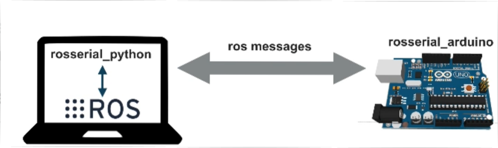
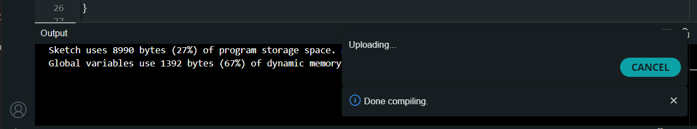
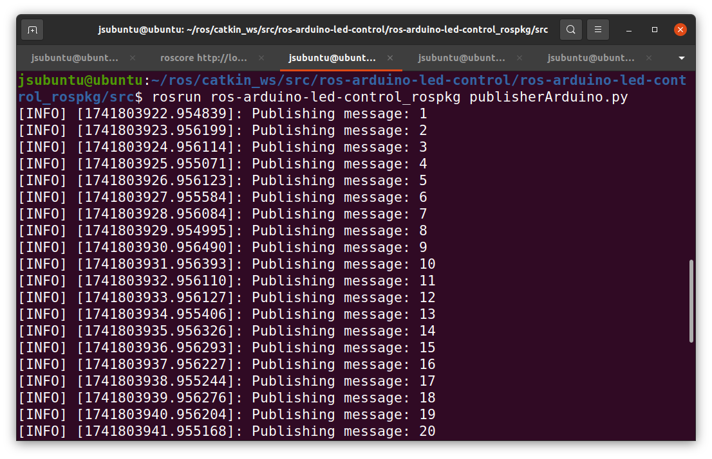
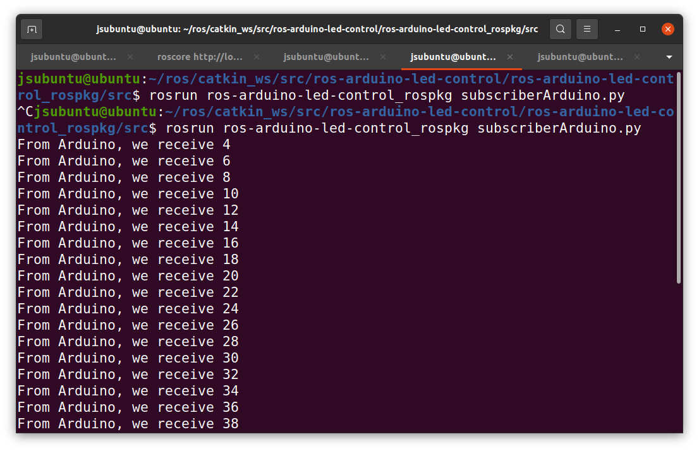
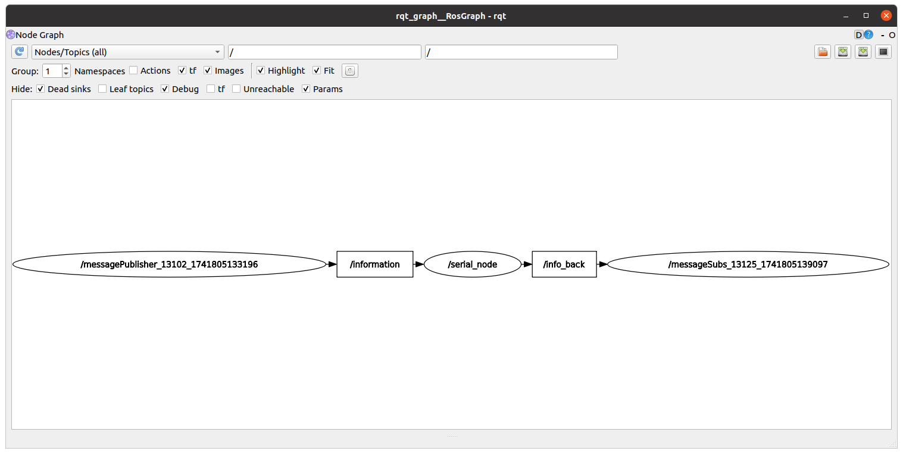

# <u>Second Try</u>

This part I am going to create a pubisher and subcriber in ROS and communicate with Arduino board. This time it will be two way communication.



>Scenario:
>Once the ROS publish a message to 'information' topic. Then Arduino will subscribe information from that topic, make it twise and publish the result to 'info_back' topic.

1. First created a package inside the folder using below command;

```catkin_create_pkg ros-arduino-led-control std_msgs rospy roscpp```

- Have been added some depedencies like std_msgs, rospy and roscpp.

2. Then created the `publisherArduino.py` and `subscriberArduino.py` for ROS commication.

3. Change the file persimmison as executables using;

```chmod +x publisherArduino.py```
```chmod +x subscriberArduino.py```

4. Created Arduino file _IntegerMultipleByArduino_.

5. Upload the file to Arduino.



6. Run the publisher file



7. Run the subcriber file



8. RQT Graph




8. Communication is successfull !!!.